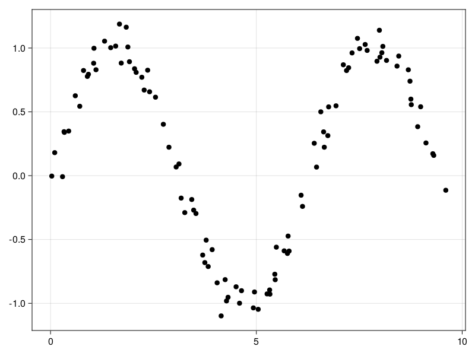
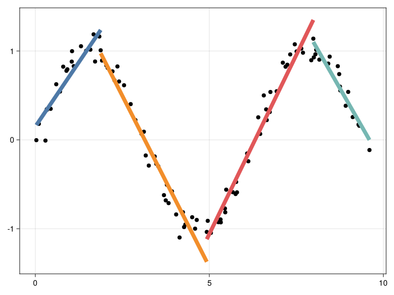
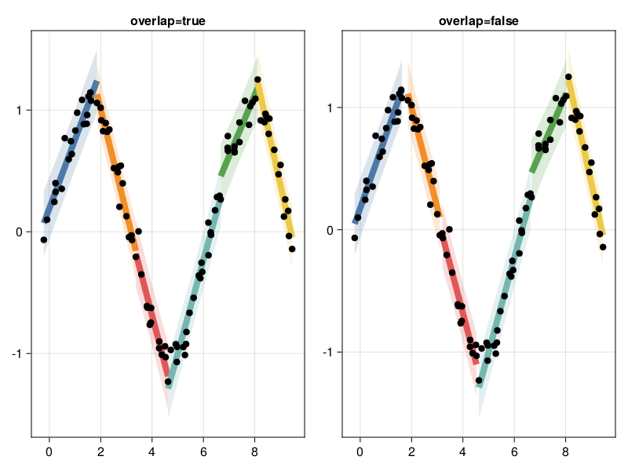
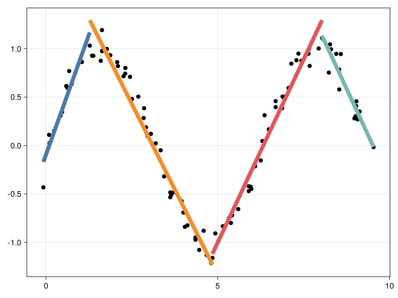

# LinearSegmentation

[repostatus-url]: https://www.repostatus.org/#active
[repostatus-img]: https://www.repostatus.org/badges/latest/active.svg

[](https://github.com/stelmo/LinearSegmentation.jl/actions/workflows/CI.yml?query=branch%3Amaster) [![repostatus-img]][repostatus-url] [](https://pkgs.genieframework.com?packages=LinearSegmentation)

This is a small package that performs linear segmented regression: fitting
piecewise linear functions to data, and simultaneously estimating the best
breakpoints. Three algorithm are implemented, `sliding_window`, `top_down`, and
`graph_segmentation`.

# Interface
```julia
segments, glm_fits = segmentation_function(
    x_values, 
    y_values; 
    min_segment_length = minimum_segment_x_length, 
    max_rmse = maximum_root_mean_squared_error,
)
```
Where each `segment` in `segments` is a type of `LinearSegmentation.Segment`,
which contains all the indices of `x_values` used in the `segment`.
Corresponding to each `segment` is a `GLM.LinearModel`, which is the fitted
linear model to the `segment`. Minimum segment lengths are specified with
`min_segment_length` and maximum allowed root mean square error for a segment is
set with `max_rmse`. Both of these kwargs have large effects on the segmentation
- play around to see what works best for your data.

# Generate some data
```julia
N = 100
xs = collect(range(0, 3 * pi, length = N)) .+ 0.1 .* randn(N)
ys = sin.(xs) .+ 0.1 .* randn(N)
```


# Sliding window
```julia
segs, fits = sliding_window(xs, ys; min_segment_length=1.2, max_rmse=0.15)
```


# Top down
```julia
segs, fits = top_down(xs, ys; min_segment_length=1.2, max_rmse=0.15)
```


# Graph segmentation
```julia
segs, fits = graph_segmentation(xs, ys; min_segment_length=1.2, max_rmse=0.15)
```


# Other useful resources
1. https://cran.r-project.org/web/packages/dpseg/vignettes/dpseg.html#appi
2. E. Keogh, S. Chu, D. Hart and M. Pazzani, "An online algorithm for segmenting
   time series," Proceedings 2001 IEEE International Conference on Data Mining,
   San Jose, CA, USA, 2001, pp. 289-296, doi: 10.1109/ICDM.2001.989531.