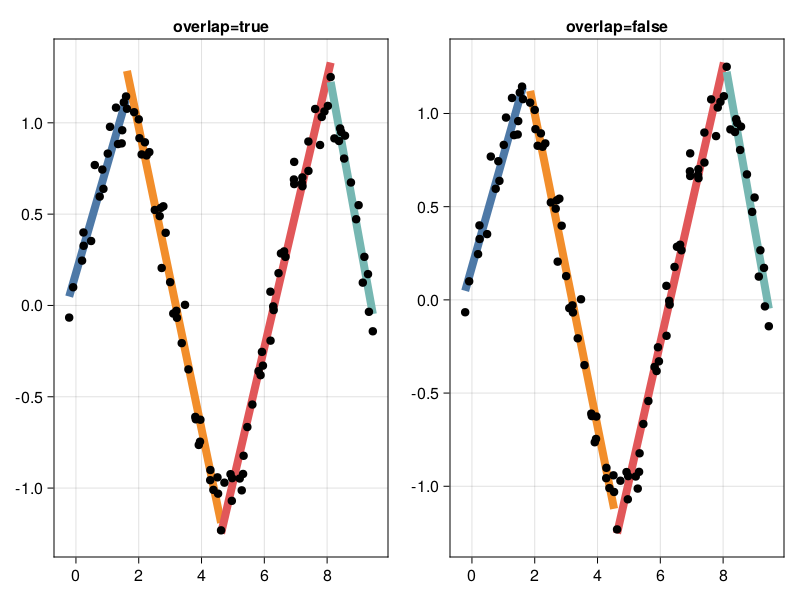

# LinearSegmentation

[repostatus-url]: https://www.repostatus.org/#active
[repostatus-img]: https://www.repostatus.org/badges/latest/active.svg

[](https://github.com/stelmo/LinearSegmentation.jl/actions/workflows/CI.yml?query=branch%3Amaster) [![repostatus-img]][repostatus-url] [](https://pkgs.genieframework.com?packages=LinearSegmentation)

This is a small package that performs linear segmented regression: fitting
piecewise linear functions to data, and simultaneously estimating the best
breakpoints. Three algorithm are implemented, `sliding_window`, `top_down`, and
`shortest_path`.

## Interface
```julia
using LinearSegmentation

segments = segmentation_function(
    x_values, 
    y_values; 
    min_segment_length = minimum_segment_x_length, 
    fit_threshold = minimum_r2,
    fit_function = :r2,
    overlap = true,
)
```
Where `segments = [idxs1, idxs2, ...]` is an array of indices, with `idxs1`
corresponding to the indices of `xs` in the first segment, `idxs2` the second
segment, etc. Minimum segment lengths are specified with `min_segment_length`.
By default, the goodness-of-fit is measured using the coefficient of
determination (R²). Each segment must have a minimum R² of `fit_threshold`. Root
mean squared error can also be used by setting `fit_function = :rmse`, and
adjusting `fit_threshold` to a dataset dependent error threshold. In this case,
the root mean squared error must be smaller than `fit_threshold` for each
segment. By default, the end of a segment is also the start of the next segment,
but this can be changed by setting `overlap` to `false` (resulting in disjoint
segmentations).

## Generate some data
```julia
N = 100
xs = collect(range(0, 3 * pi, length = N)) .+ 0.1 .* randn(N)
ys = sin.(xs) .+ 0.1 .* randn(N)
```


## Sliding window
Uses a sliding window approach to segment the data: initially an empty segment
is made, and data added to it until `fit_threshold` is reached. Then a new
segment is made, and the process repeats until the data is exhausted. This
algorithm is the cheapest to run, but may generate worse fits due to its
simplicity.
```julia
segments = sliding_window(xs, ys; min_segment_length=1.2)
```


## Top down
This algorithm recursively splits the data into two parts, attempting to find
segments that are both long enough, and have a good enough fit (set via the
kwargs).
```julia
segments = top_down(xs, ys; min_segment_length=1.2)
```


## Shortest path
This algorithm is *my take* on the dynamic programming approaches used by the R
packages listed below (NB: not equivalent implementations!). In essence, a
weighted directional graph is constructed, where each node corresponds to an
index of `xs`, and the edge weight between nodes corresponds to the
goodness-of-fit measure between the two nodes (segment length restrictions and
maximum error are both incorporated). The shortest weighted path that spans `xs`
is the found with `Graphs.a_star` (see
[Graphs.jl](https://github.com/JuliaGraphs/Graphs.jl)), and should correspond to
the best segmentation.
```julia
segments = shortest_path(xs, ys; min_segment_length=1.2)
```


## Other useful resources
1. https://cran.r-project.org/web/packages/dpseg/vignettes/dpseg.html
2. https://winvector.github.io/RcppDynProg/
3. E. Keogh, S. Chu, D. Hart and M. Pazzani, "An online algorithm for segmenting
   time series," Proceedings 2001 IEEE International Conference on Data Mining,
   San Jose, CA, USA, 2001, pp. 289-296, doi: 10.1109/ICDM.2001.989531.